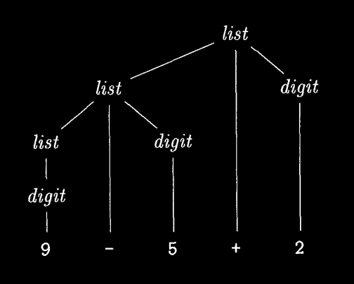

# Simple Syntax Directed Translator
### Syntax Definition
**Context Free Grammar** is a kind of notation for formally describing valid syntax. It has **four** components:
1. **Terminals** are literals
2. **Non-Terminals** are variables
3. **Productions** assigning every single non terminal to a sequence of terminals & non terminals combined with logical operators (AND & OR)
4. A starting **Non Terminal**

For example here is a context free grammar describing a list of digits separated by plus or minus.

```
list => list operation digit | digit
operation => "+" | "-"
digit => "0"|"1"|"2"|"3"|"4"|"5"|"6"|"7"|8"|"9"
```
Each line here represents a production.
The non-terminals here are **list**,**digit** and **operation**. While the terminals are everything between quotes.

An empty string is denoted by epsilon (∊). When a unit is optional, it should be ORed with ∊
```
optional_parameters = parameters | ∊
```

Must Read:
- [What is a Context Free Grammar?](https://stackoverflow.com/questions/6713240/what-is-a-context-free-grammar) @Stackoverflow
- [What does "context-free" mean in the term "context-free grammar"?](https://softwareengineering.stackexchange.com/questions/253454/what-does-context-free-mean-in-the-term-context-free-grammar) @Software Engineering Stack Exchange

**Derivation** A grammar derives strings by beginning with the start symbol and repeatedly replacing a nonterminal by the body of a production for that nonterminal. The terminal strings that can be derived from the start symbol form the language defined by the grammar.

A **Parse Tree** is the output of a parser. It is a tree whose root is the start non-terminal, its leafs are terminals, and all other interior nodes are non-terminals.



A parse tree node may have many children, ordered from left to right. epsilon is a valid terminal.

A grammar is **ambiguous** if there is a string with two valid parse trees or more.

**Operators Precedence** determines order of operations if for an expression with multiple operators.

**Associativity of Operators** is a property that determines how operators of the same precedence are grouped in the absence of parentheses **OR** it means  when same operator appears in a row, then which operator occurence we apply first.

**Left associative** means expression is evaluated from left to right, while **right associative** is the opposite.

The grammar for a right associative operator is
```
expression => exprssion operator term | term
```
and for left associative,
```
expression => term operator expression | term
```

It makes more sense to assign all operators of same precedence the same associativity.

To make a grammar with the normal arithmetic operators precedence, we put every precedence level in its own production:

```
plus_or_minus   => "+" | "-"
times_or_divide => "*" | "/"
expression      => expression plus_or_minus term
term            => term times_or_divide factor
factor          => number | "(" expression ")"
```

Read More: 
- [What is associativity of operators and why is it important?](https://stackoverflow.com/questions/930486/what-is-associativity-of-operators-and-why-is-it-important)
- [Why Associativity is a Fundamental Property of Operators But Not that of Precedence Levels?](https://stackoverflow.com/questions/11700550/why-associativity-is-a-fundamental-property-of-operators-but-not-that-of-precede)
- [Generalizing the expression grammar with operators precedence: The Text Book page 50](quotes/page_50.md)


#### Up Next: 2.2.5 Associativity of Operators (page 71)