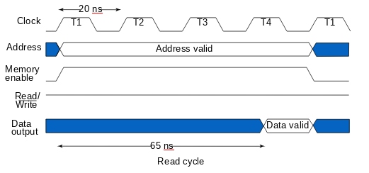
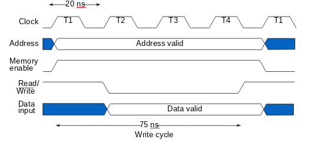

#### 1. Consider a memory with a capacity of 1K x 16 words . Find K and n.
**Solution**  
Since Memory of 1k words = 2^(10)  
Therefore, K address lines = 10  
Since word = 16 bits long  
Therefore, n data lines = 16  
Ex: k = 24, n = 64, memory capacity = 16 M x 8B= 128MB

#### 2. Assume that a CPU operates with a clock frequency of 50 MHz, giving a period of 20 ns for one clock pulse. Suppose now that the CPU communicates with a memory with an access time of 65 ns and a write cycle time of 75 ns.
**Solution**  
- Most basic memories are asynchronous
    - Storage in latches or storage of electrical charge
    - No clock
- Controlled by control inputs and address
- Timing of signal changes and data observation is critical to the operation
- Read timing: 
- Write timing: 

#### 3. Design a 16×1 RAM Using a 4×4 RAM Cell Array.
**Solution**  
$\because \text{memory has 16 memory locations}$

$\therefore \text{physical address lines} K = 4$

$\sqrt{\text{total number of bits}} = \sqrt{16} = 2^2  \implies K/2 = 2$

- Therefore, the row decoder takes its two MSBs,
- And , the column decoder takes its two LSBs.

#### Design 32k x 8 RAM using coincident selection?
**Solution**  
- Since, memory has 32K memory locations = 2^(15) 
- Therefore, Physical address lines K = 15
- √(𝑡𝑜𝑡𝑎𝑙 𝑛𝑢𝑚𝑏𝑒𝑟 𝑜𝑓 𝑏𝑖𝑡𝑠)= √(2^(15)  𝑥 8) = 2^9  
-  Therefore, K / 2 = 9
- Therefore, the row decoder takes its 9 MSBs,
- And , the column decoder takes the rest from the physical address = 15-9 = 6 LSBs.
- To make the memory array square, each output of the column decoder was multiplied by 8. i.e., select 8 bits.

### Assignment
1. Explain the construction & operation of sense amplifier in SRAM?
2. The following memories are specified by the number of words times the number of bits per word. How many address lines and input–output data lines are needed in each case?
    1. 48K × 8
    2. 512K × 32,
    3. 64M × 64, and 
    4. 2G × 1.
3. A 64K×16 RAM chip uses coincident decoding by splitting the internal decoder into row select and column select. Assuming that the RAM cell array is square, what is the size of each decoder, and how many AND gates are required for decoding an address?