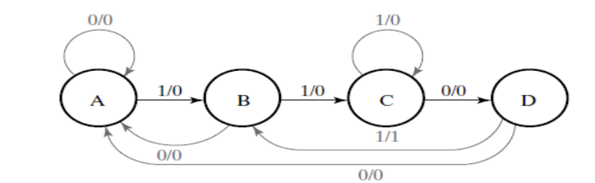
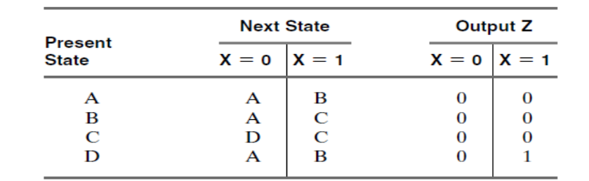
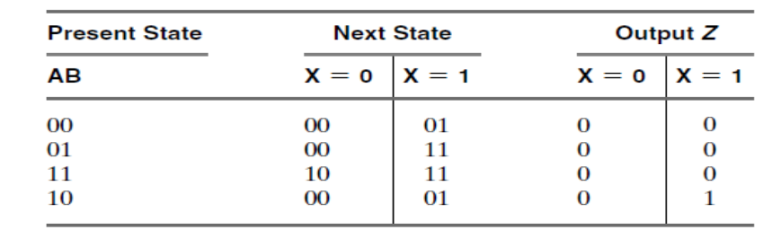
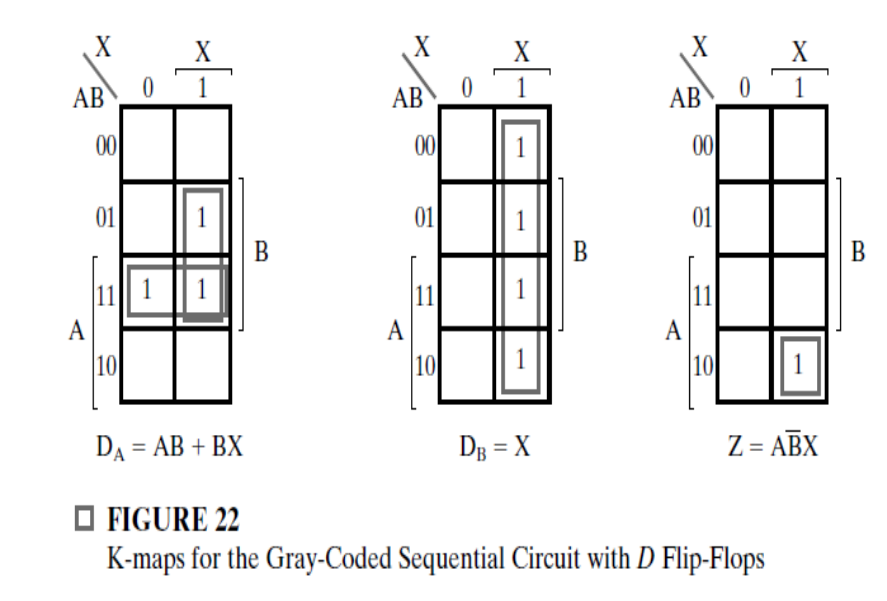
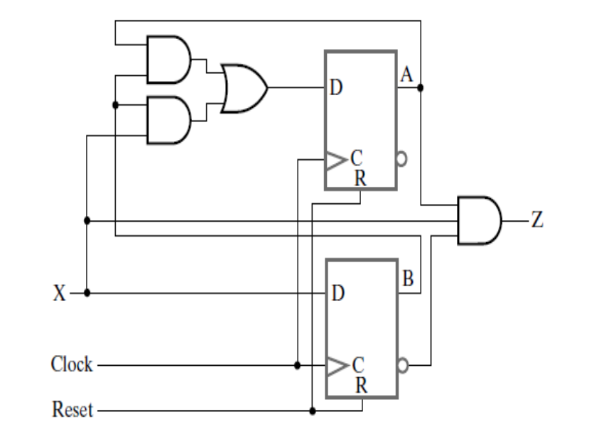
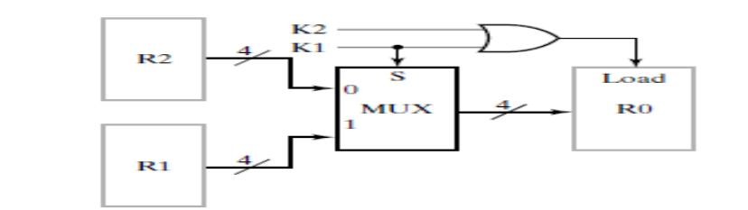
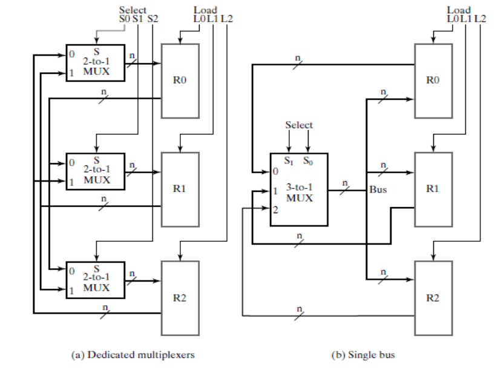

### 1. Finding a State Diagram for a Sequence Recognizer
The circuit is to recognize the occurrence of the sequence of bits 1101 on X by making Z equal to 1 when the previous three inputs to the circuit were 110 and current input is a 1. 

$D_A(A,B,X) = \sum{m(3,6,7)}$
$D_B(A,B,X) = \sum{m(1,3,5,7)}$
$Z(A,B,X) = \sum{(5)}$

### 2. Homework: Implement? On slide 32 I don't know what that means.

### 3. Assignment 7-1
Design The Following RTL:
 (K1 +K2) : R1 ← R2+R3, R4 ← R5 V R6

### 4. Multiplexer Based Transfer
**Consider**

$if (K1= 1) then (R0 ← R1) \\
else if (K2 = 1) then (R0 ← R2)$

**Maybe also be written as**

$K1: R0 ← R1,  (𝐾1)^− . K2: R0 ← R2$

| K1  | K2  | Selection MUX | Load of R0 |
| :-- | :-- | :------------ | :--------- |
| 0   | 0   | R2 -> 0       | 0          |
| 0   | 1   | R2 -> 0       | 1          |
| 1   | 0   | R1 -> 1       | 1          |
| 1   | 1   | R1-> 1        | 1          |

### 5. Bus Based Transfer
**Consider**  

$R0 ← R2\\
R0 ← R1 , R2 ← R1\\
R0 ← R1 , R1 ← R0$

We need a multiplexer whose output length = (at least) number of output registers. Same for number of load signals.

So **4x2 MUX** and **load signals**.
Transfer,Select , Load
| Transfer          | S1 | S0 | L2 | L1 | L0 |
| :---------------- | :- | :- | :- | :- | :- |
| R0 ← R2           | 1  | 0  | 0  | 0  | 1  |
| R0 ← R1 , R2 ← R1 | 0  | 1  | 1  | 0  | 1  |
| R0 ← R1 , R1 ← R0 | | | | | Impossible 

### 6. Assignment 7-2
Show the diagram of the hardware that implements the register transfer statements:
$$
C1:R1 ← R1 + R2\\
\overline{C1}C2:R1 ← R1 + 1
$$

### 7. Assignment # 7-3
Design a memory transfer system that has three address registers, three data registers, address bus , data bidirectional bus, Decoders, and implement the following statements:
$$
DR1← M [AR2], M [AR1] ← DR2
$$