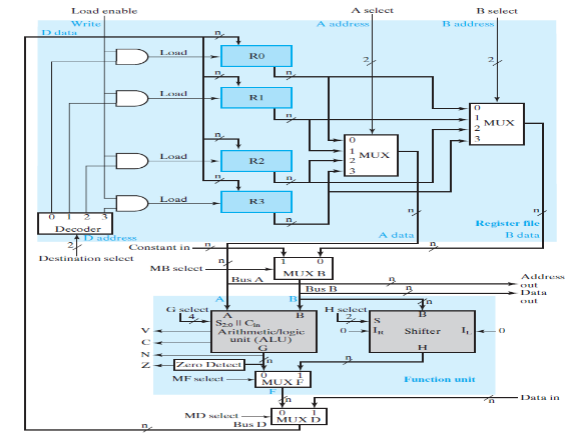
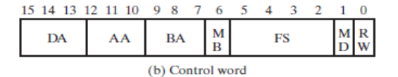

### 1. Example for simple bus-based datapath

- Function unit is composed of ALU & Shifter.
- Inputs 
  - `A` & `B` are represented as MUXs
  - ALU takes `A` & `B`, while shifter takes `A` only.
  - `B` might be a register or a constant.
  - `A` might be a memory address. `B` may be written to memory.
- Output 
  - might be from ALU, Shifter, Memory. 
  - Only ONE register may be loaded at a time.
  - `load enable` signal may disable loading completely.

The group of signals driving all that is called a **Control Word**.

### 2. Specify the control word to perform the following microoperation: $R1←R2 +R3$
**Solution** 
- AA = 10
- BA = 11 
- MB = 0
- G = ADD code
- MF = 0
- MD = 0
- Destination select = 01
- Load enable = 1

### 3. ALU Detailed Example
ALU's inter