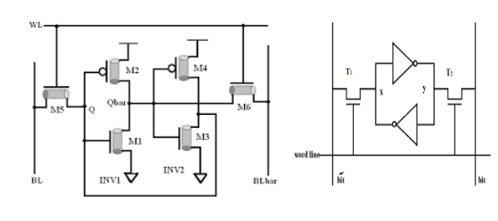
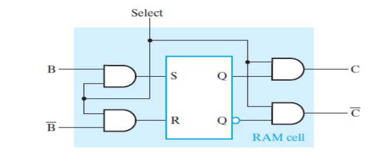
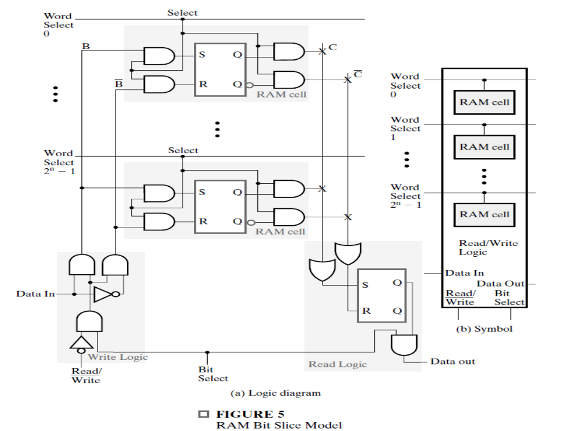

### Basic Definitions

<!--slide 3-->

**Memory** is an indexed array of **word**s, each index is called a **memory address** combined with logic circuits (like decoder or chip select). 

<!--slide 5-->

A **Word** is the size of data moving in or out memory as a unit. 

<!--slide 4-->

**Access Time** is max time between sending address and resonse (appearance of data for read or storing completion for write) 

**Memory Cycle Time** is minimum period between two  successive requests. 

<!--slide 5-->

Communication with memory requires:
1. **Data Lines**
2. **Address Lines**
3. **Control Lines** to determine direction of data

<!--slide 7-->

$k\ address\ lines \Rrightarrow 2^k\ words$

### Conventions
A memory of capacity $m.n$ bits means it has:
- $m$ **addresses**.
- $n$ **bits per word**.
- **Address Lines** $ k = \log_2{m} $.

Important Prefixes
- $K = 1028$
- $M = K^2$
- $G = K^3$ 

<!--slide 9-->

### [Operation](media/memory-input-truth-table.png)
**[Read Steps](media/read-cycle.png)**
1. Send address on address line.
2. Activate **Read** input.

**[Write Steps](media/write-cycle.png)**
1. Send address on address line.
2. Send data on data line.
3. Activate **Write** input.

**RAMs** can be **Static** meaning they use latches, or **Dynamic** meaning they use capacitors. They can also be **volatile** or **non-volatile**.

### SRAM Cell

To design a RAM IC, in addition to the RAM cells we need:
1. **Decoder** to select word via address.
2. **Tri-State Buffer** obeys enable input, disconnecting IC from bus (Hi-Z) when enable is false.

Quick Notes
- A **Word** is width of unit CPU handles in a single operation.
- A memory can be **Word Addressable** meaning every address points to a word, or it can be **Byte Addressable** meaning that every byte has an address.
- The number of physically possible addresses is called **Address Space** and the number of addresses available within the memory's capacity is called **Address Range**.

A **straightforward RAM IC design** will require **number of AND gates = number of addresses** and if every bit is addressable and word size is large that will cause read/write to take too many cycles.

A better alternative is the **coincident selection design**. Instead of treating RAM as a single row, we treat is a square of words. With 2 decoders, one for row-select and one for column-select.

If number of address lines $K$ is even, then number of addresses (in address space) is squarable. In that case each of row-decoder and column-decoder take $K/2$ address lines. Otherwise, column decoder takes an extra line.

$$ \text{rows} = floor(K/2) , \text{columns} = \text{the rest} $$

**Up Next** slide 30
