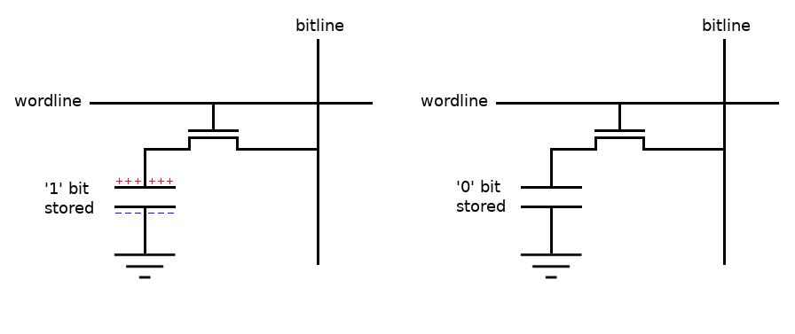
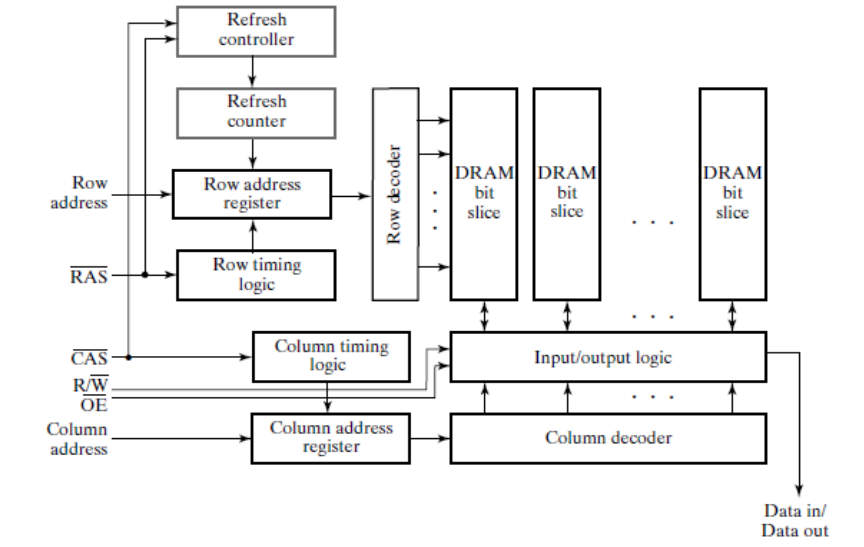
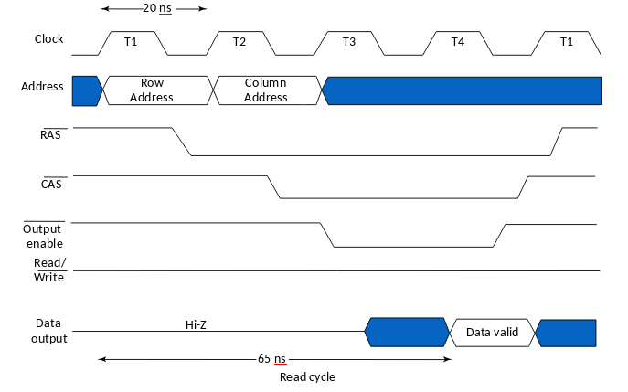
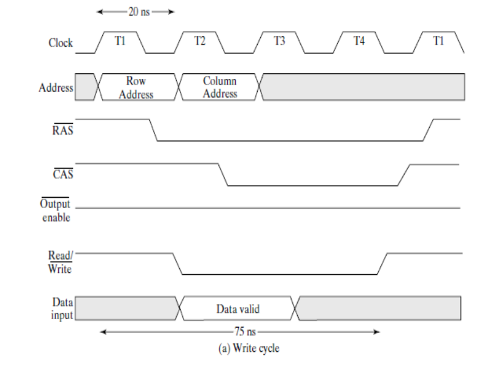

### Dynamic RAM Cell
DRAM needs periodic **refreshment** (as opposed to SRAM)

**DRAM reading is desctructive**, meaning a read operation destroys stored data (as opposed to SRAM).

A DRAM cell is composed of a **capacitor** and a **transistor** acting as a switch. When switch is open charge is trapped, when it is closed charge flows allowing reading and writing. **Word line** controls the transistor. **Bit line** is for reading and writing. Reading and writing is done by a circtuit called **Sense amplifier** connected to bit-line, it detects minute difference in charge and outputs corresponding logic level. 

> **Vdd/2** is applied on bit-line to reduce time and power of charge transfer.

### Dynamic RAM Controller

DRAM IC is controlled through the following inputs (active low)
- **Row Address** & **Column Address**
- **$\overline{\text{RAS}}$** Row Address Strobe & **$\overline{\text{CAS}}$** Column Address Strobe
- **$\text{R}/\overline{\text{W}}$** Read/Write
- **$\overline{\text{OE}}$** Output Enable

### Addressing, Reading & Writing (Using the DRAM protocol)
To select a row, you send **row address** then activate **RAS**. To select a column, send **column address** then activate **CAS**. 

Both rows & columns addresses are stored in registers, which in turn are connected to row and column address decoders.

When a row is selected, it gets entirely read by an array of sense amplifiers, which also acts as a **row buffer (registers)**. Then when a column is selected, **column address decoder** selects target column from row register.

If **R/W** is on READ while column address is sent, the selected column from the row buffer is sent over data lines (OE has to be enabled). Also the read address is considered refreshed afterwards.

If on the other hand **R/W** is on WRITE, data on data lines is applied to selected column from row buffer (the sense amplifiers), which gets immediately reflected on the DRAM cells of the selected row.

> As long as **RAS** is enabled it the transistors of the cells are ON.

**All the above operations in the DRAM protocol, are managed by DRAM controller, usually part of CPU, previously was a dedicated part.**

### Memory Refresh
- It's reading and rewriting a portion of memory without modification. 
- While refreshing, memory is not available for read or write.

Refreshing is only done externally through DRAM controller. To refresh a row, you select it then unselect it.

To do that, there are **three methods:**

1. **RAS only**, to refresh a specific row, send its address, activate RAS then deactivate it.
2. **CAS-before-RAS refresh**, activate CAS *THEN* RAS. The DRAM will respond by refreshing next row to be refreshed, which is determined by **refresh counter**. Further toggling RAS, refreshes next rows.
3. **Hidden refresh** basically toggling RAS upon normal read or write, effectively performing CAS-before-RAS. (Output is valid during refresh)

Refersh has 2 types:
1. **Burst Refresh** refresh the entire memory in one shot.
2. **Distributed Refresh** refresh parts of memory sequentially at evenly spaced time intervals.