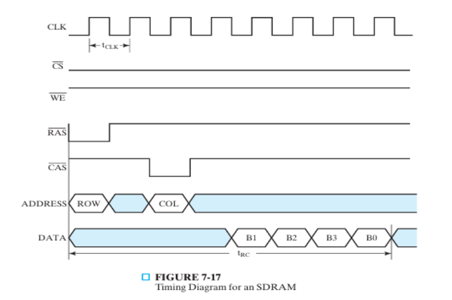

Missing slide 3 - defining **lines**, **burst read**, **effective rate vs access time**.

**Burst mode** is reading/writing consecutive bytes without requiring further requests, a byte per cycle. Number of bytes is called **burst length**. 

Some DRAM types are **asynchronous** meaning they have no clock, **synchronous** meaning memory speed is synchronized with system clock, and **graphics DRAM** which can sync or async.

**SDRAM** (Synchronous DRAM) differences from **DRAM**
- can be divided into **banks**, allowing overlapped access (interleaving memory). 
- has **registers** for address and data input & output.
- **column address counter** to specify burst length.
- operation timing is different.
  - on row selection, entire row is read internally and stored in **IO logic**, this takes few cycles.
  - burst length is set by **mode control word**.

*SDRAM Timing Diagram*

**Double Data Rate Synchronous DRAM** transfers on both edges of clock.

UP NEXT: How to Improve Bandwidth in DDRAM