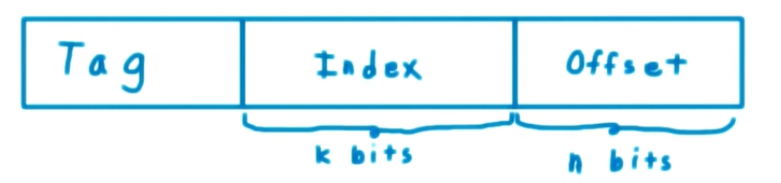

The separation of CPU & memory limits instructions & data access rate, this is called **Von Neumann bottleneck**. One of the ways to improve the situation is **Caching**. An important concept here is **locality**, whether **temporal** or **spatial**. The lowest level of **Memory Hierarchy** is the cache (fastest & smallest), next level is main memory, and last is the hard drive.

#### Caches can be multi levels
For example **L1** and **L2** cache. In that case **L2** handles **L1**'s cache misses. Also cache can be specifically designed for CPU needs, it may separate data and instructions to allow simultaneous access to both in a single cycle.

**Cache Mapping** means, given a memory address determine if it is in cache. There are multiple techniques:
- **Direct Cache Mapping** 
- **Fully Associative Cache Mapping**
- **Associative Memory**
- **Set-Associative Cache Mapping**

#### Direct Cache Mapping
Suppose you have
- $2^m$ addresses
- $2^k$ cache entries
- $2^n$ block size 

Given a memory address, divide it into 3 sections **offset**, **index** and **tag**.

At each **index** in cache both **tag** and **n** blocks of data are stored. 

At memory access, if at index, same tag is found then data is in cache.

Drawback: All addresses with same index can only have one cached address at a time.

#### Fully Associative Mapping
Any address can be cached at any location, the tag becomes the whole address (minus the offset).

At memory access, address is compared with all tags in cache sequentially.

Drawback: Has to read whole cache before deciding on miss or hit.

#### Associative Memory
**Associative memory** means content-addressable memory **CAM**, meaning it has a matching circuit that compares all its content simultaneously. 

The subfield choosen for addressing (which is the tag) is called **key**.

Matching circuit is **XOR**.

Obvious drawback: large amount of matching circuits, increasing cost & size.

#### Set-Associative Cache Mapping
This technique is a mix of direct-mapped and a fully associative cache.

Instead of an index having a single entry (tag+data), it has a set of them. **N-way** set associative means each set is of size **N**.

On memory access, the entire set at an index is read simultaneously, then tag is compared on all of them simultaneously using a matchine circuit for each.

------------------------

To explot spatial locality, each tag might contain multiple words (called a line) on each cache miss, an entire line is fetched.

In that case, non-tag fields in address may have an additional field **word**.

Cache Replacement Approaches
- **Random**
- **FIFO** First In First Out
- **LRU** Last Recently Used

#### Writing Approaches
**Write Through.** Writing to cache directly writes to main memory.  
Pros:
- Simple to implement
- Ensure data consistency

Cons:
- Horrible performance
- Increased memory traffic

**Write Back.** Writing to cache only eventually writes to main memory, typically on replacement. 
Pros:
- Awesome performance
- Decreased traffic
Cons:
- Complex to implement
- Data loss potential (Doesn't make sense)

### Videos
- [Direct Mapping](https://www.youtube.com/watch?v=JRBKPNjV8fY)
- [Fully Associative Mapping](https://www.youtube.com/watch?v=bIcCOKwulzo)