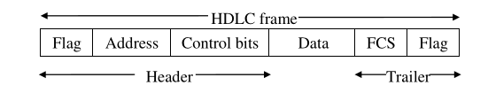
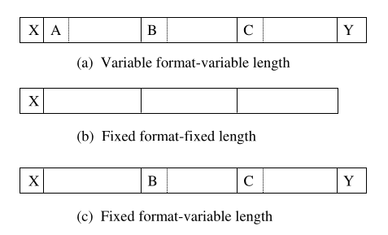

Data link layer is needed to

1. Handle transmission errors
2. Control data flow

These things are not provided by physical layer

Data link layer is served by physical layer, and serves network layer. Data link layer recieves bits from network layer and wraps it with control bits forming a **frame**.

In OSI model, data received from a higher layer is called **SDU** (Service Data Unit) and data sent to a lower layer is called **PDU** (Protocol Data Unit). For Datalink layer these are called **DL-SDU** and **DL-PDU** which is the frame.

Data link layer should provide the following features:
- **Sequencing** Maintain DL-SDU sequence integrity.
- **Error Notification** Notify network layer of unrecoverable error.
- **Flow Control** Allow network layer to control data rate.
- **Quality of Service Parameters** Provide network layer with selectable quality of service parameters.

Data link protocol specifies:
- **Frame Format** Location and size of its fields
- **Contents of fields**
- **Control Messages Sequence** (for error and flow control, and datalink management functions)

Protocols Examples
- **BISYNC, BSC** Binary Synchronous Data Link Control
- **SDLC** Synchronous Data Link Control 
- **HDLC** High- Level Data Link Control 
- **ADCCP** Advanced Data Communication Control Procedure 
- **PPP** Point-to Point Protocol

### Frame Design Considerations

A frame is usually composed of **header**, **data** and **trailer**.

**HDLC frame format**

- **Flags** determine frame start and end
- **Address** determines source and destination. 
- **FCS** stands Frame Check Sequence.
- **Control** contains control info like sequence number & receipt acknowledgement.

Frames have 2 types:
1. Data Frame
2. Control Frame

**Frame Format** has 3 types:
- **Variable Format-Variable Length** Fields have variable length, order and optional presence. (Needs identifiers/delimiters to mark frame start and end, and also each frame start).
- **Fixed Format-Fixed Length** Fields order and length are fixed. (Needs only frame start identifier)
- **Fixed Format-Variable Length** Fields have variable fixed order but variable length. (Needs to mark everything except start of first field)

**Transparency** means providing a service with no restriction on user data. (A challenge here is the possibility of data to contain frame fields identifiers/delimiters)

A data link protocol maybe **Bit Oriented** meaning a frame and its fields are multiples of bits (not necessarily bytes) or can be **Byte Oriented** meaning a frame & its fields are multiples of bytes. 

HDLC is a bit-oriented protocol. BISYNC is byte-oriented.

### Error Control
There are two types of errors
1. **Content Errors**, an error in the frame.
2. **Flow Integrity Error**, lost or duplicate frames.

Content error detection happens by either **parity check** or **cyclic redundancy check (CRC)**. They check the entire frame except flags.

Content error correction most common method is **Automatic Repeat Request (ARQ)**, in which receiver notifies sender to either send another copy, or acknowledge its correct receipt.

To measure the effectivenes of error control methods use **Residual Error Rate (RER)**. 

### Idle RQ (Stop & Wait)

**ARQ** has 2 basic types:
1. **Idle RQ** also called **stop and wait**. (byte oriented transmission)
2. **Continuous RQ** (bit oriented), employs:
    - **Selective Repeat**
    - **Go Back N**

Stop & Wait is half duplex. It has two implementations:
1. **Implicit Retransmission** No acknowledgment frame (ACK-frame) means an error. If acknowledgment is corrupted, sender sends another copy. Timeout at least = transmission + processing time of a frame and its acknowledgment.
2. **Explicit Retransmission** Negative acknowledgment means an error. Receiver returns **ACK-frame** on success, and **NAK-frame** on error. A timeout is still needed to account for frame not reaching at all.

Duplicate frames are determined thanks to **sequence number**. Then they are dicarded.

Link utilization is determined by **BER** (Bit Error Rate)

#### Link utilization in an error free transmission

$$ U=\frac{Tix}{Tt} = \frac{Tix}{Tix+2Tp} = \frac{1}{1+2a} $$
Where,
- **U** Utilization
- **Tix** Transmission Time
- **Tt** Total Time (till ACK)
- **Tp** Propagation Delay
- **a** = $Tp/Tix$

#### Link utilization in presence of errors

$$ Nr = \frac{1}{1-P_f} = \frac{1}{(1-P)^L} $$

Where,
- **Nr** Average number of transmissions per frame
- **Pf** Probability that a frame has an error
- **P** Probability of single bit error
- **L** Length of frame

[Proof](media/chapter2.md/average-transmission-proof.png)

In implicit retransmission,
$$ Tt = (N_r - 1)To + Tix + 2Tp , $$
$$ \text{where To is time out interval.} $$
$$ U = \frac{Tix}{(N_r - 1)To + Tix + 2Tp} = \frac{1-Pf}{(1+2a)(1+Pf)+Pf(To/Tix)}$$
In explicit retransmission,
$$ Tt = N_r(Tix + 2Tp) $$
$$ U = \frac{Tix}{N_r(Tix + 2Tp)} = \frac{1-Pf}{1 + 2a}$$

Major advantage of Idle RQ is requiring minimum buffer storage on both ends, since it only requires sender to to be able to resend last sent frame, and for receiver to retain only sequence number of last received frame.

### Continuous RQ 
It enables higher link utilization, but requires larger buffer and full duplex link.

If next in-sequence frame is recieved, it's served to upper layer. If a frame is received out of sequence, it is kept in buffer until a group of sequential frames is received, at which point it is given to upper layer.

There are two mechanisms,
1. **Selective Repeat**
    - **Implicit Retransmission** Here sender retains a frame until it gets positive acknowledgment, and resends it when timeout is reached.
    - **Explicit Retransmission** Here sender retains a frame until positive acknowledgment, and resends in case of NAK or timeout. (There is a problem here, apparently once a NAK is sent, no ACKs are sent until the wronged frame is corrected, then ACK for the last correct frame only is sent)

    In both cases receiver retains frames, until it a has an ordered group of frames. On receiving a duplicate, receiver resends **ACK**. Therefore, this method requires a large buffer on both ends.
2. **Go Back N**
   
    On NAK, sender resends all frames starting from wronged frame. This minimizes buffer on receiver side, but there is a lot of duplication.

### Up Next: Flow Control